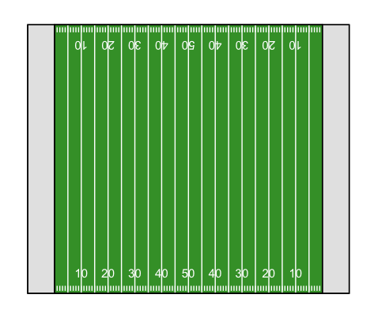

# ggfootball

This package contains a single function (also called ggfootball) that produces a plot of an American football field using ggplot2 objects. 

Originally, this function was created for the NFL Big Data Bowl 2021 on [Kaggle](https://www.kaggle.com/c/nfl-big-data-bowl-2021). To keep with the conventions of the datasets provided in linked Kaggle contest, the plotted field spans from 0 - 120 in the x-direction and 0 - 53.3 in the y-direction. No arguments are required for the ggfootball() function to produce a plot, but several optional arguments are available for customization.

It is expected that users will add other ggplot2 objects (e.g., points representing players, text annotations) to produce complete visualizations.
